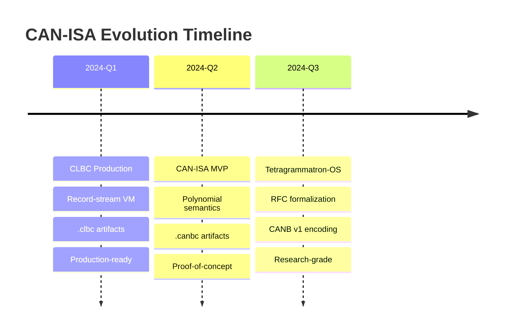
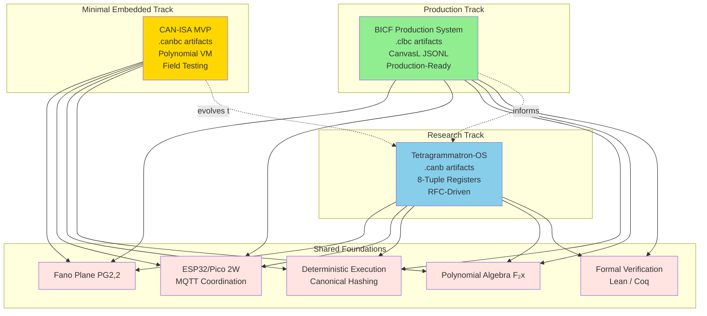

# Tetragrammatron-OS and BICF Relationship

**Version:** 1.0.0
**Last Updated:** 2025-12-20

This document explains the relationship between the three computation systems in this repository: BICF Production System, CAN-ISA MVP, and Tetragrammatron-OS.

---

## Table of Contents

1. [Quick Answer](#quick-answer)
2. [Evolution Timeline](#evolution-timeline)
3. [The Three Systems](#the-three-systems)
4. [What's Shared](#whats-shared)
5. [What Diverges](#what-diverges)
6. [System Relationships](#system-relationships)
7. [When to Use What](#when-to-use-what)
8. [Artifact Formats](#artifact-formats)
9. [Hardware Support](#hardware-support)
10. [For More Information](#for-more-information)

---

## Quick Answer

**What are these three systems?**

### BICF Production System
Production-ready boundary-interior computational framework with CanvasL JSONL execution, Native Repository Runtime (NRR) storage, formal verification, and comprehensive documentation. Uses `.clbc` artifacts with record-stream bytecode.

### CAN-ISA MVP
Minimal polynomial virtual machine for embedded devices with deterministic canonical state hashing using univariate F₂[x] polynomials. Proof-of-concept implementation producing `.canbc` artifacts.

### Tetragrammatron-OS
Formal, RFC-driven geometry-first operating system and virtual machine with proof-carrying bytecode, 8-tuple semantic registers, origami fold semantics, and Lean formal verification. Research-grade system producing `.canb` artifacts.

---

## Evolution Timeline

The three systems represent different stages and tracks in computational substrate evolution:



**Key Insight**: These are not sequential versions but **parallel tracks** serving different purposes:
- **BICF** continues production development
- **CAN-ISA MVP** validates minimal polynomial semantics
- **Tetragrammatron-OS** explores formal proof-carrying computation

---

## The Three Systems

### 1. BICF Production System

**Location**: `src/`, `production-docs/`, `schemas/`

**Status**: Production-ready

**Purpose**: Complete boundary-interior computational framework for distributed deterministic computation

**Key Features**:
- **CanvasL JSONL** execution with formal schema validation
- **Native Repository Runtime (NRR)** for content-addressed storage
- **BICF Core** with 5 axioms (RFC-0001)
- **FANO boundary** module (PG(2,2) validation)
- **PCG consensus** module (Pair-Cover Guarantee)
- **AAL (Assembly-Algebra Language)** v3.2 with Coq proofs
- **Formal verification** (Lean 4, Coq) with 100% complete proofs
- **Production infrastructure** (Docker, CI/CD, monitoring)

**Artifact Format**: `.clbc` (CLBC container with record-stream bytecode)

**Documentation**: 8 production documents in `production-docs/`, comprehensive RFCs in `dev-docs/RFC-BICF-CANVASL-POLY-001/`

**Use Cases**:
- Production CanvasL program execution
- Distributed computation with deterministic consensus
- Content-addressed repository storage
- API integration and service orchestration

---

### 2. CAN-ISA MVP

**Location**: `embedded/canisa-mvp/`, `tools/can-{asm,run}.scm`

**Status**: Proof-of-concept, field testing ready

**Purpose**: Minimal polynomial virtual machine validating univariate F₂[x] canonical state representation

**Key Features**:
- **Univariate F₂[x] polynomial** state representation
- **16 minimal opcodes**: STATE_ADD, STATE_GCD, STATE_LCM, STATE_NORM, STATE_HASH, etc.
- **Deterministic canonical hashing** (SHA-256 of polynomial coefficients)
- **3-device MQTT demo** with auto-discovery and UDP support
- **Scheme assembler** (`tools/can-asm.scm`) and runner (`tools/can-run.scm`)
- **ESP32 integration** with MQTT coordination

**Artifact Format**: `.canbc` (CANBC container with polynomial bytecode)

**Documentation**: `docs/canisa-mvp.md`

**Use Cases**:
- Minimal embedded polynomial computation
- Field testing CAN-ISA semantics
- 3-device heterogeneous network validation
- Quick prototyping on ESP32/Pico

**Implementation**: Uses polynomial operations from `src/aal/polynomials.scm`

---

### 3. Tetragrammatron-OS

**Location**: `apps/tetragrammatron-os/`

**Status**: Research-grade, actively evolving

**Purpose**: Formal, RFC-driven geometry-first operating system exploring proof-carrying computation

**Key Features**:
- **6 normative RFCs** defining complete system semantics:
  - RFC-0000: CAN-ISA invariants
  - RFC-0009: Origami fold VM
  - RFC-0011: Repository lattice
  - RFC-0012: Binary encoding (CANB v1)
  - RFC-0013: Time and barriers
  - RFC-0017: LIFT_3D mesh semantics
- **8-tuple semantic registers**: state, symbol, left, right, transition, source, target, result
- **Origami fold semantics** with idempotent operations
- **32-bit fixed-width CANB v1 bytecode** encoding
- **Repository lattice** (8³ topology) with Fano merge gate
- **Lean formal verification** with 20 invariants specified
- **Geometry rendering** (SVG, GLB) with Fano projection
- **VM core in C** (~3,387 lines) with comprehensive opcode coverage

**Artifact Format**: `.canb` (CANB v1 container with 32-bit fixed-width instructions)

**Documentation**: `apps/tetragrammatron-os/README.md`, 6 RFCs in `apps/tetragrammatron-os/rfc/`, 40+ dev docs

**Use Cases**:
- Formal research on proof-carrying bytecode
- Geometric computation with Fano projections
- RFC compliance validation
- Cross-platform deterministic execution research

**Implementation Status**: Core architecture complete, polynomial operations and hardware integration stubbed

---

## What's Shared

All three systems share fundamental principles and infrastructure:

### 1. Fano Plane Geometry (PG(2,2))

The **Fano plane** is the universal geometric foundation:
- 7 points, 7 lines
- Every line contains 3 points
- Every point lies on 3 lines
- Any two points determine a unique line
- Any two lines intersect at a unique point

**BICF**: Uses Fano plane for FANO boundary validation (`src/fano/fano-checker.scm`)

**CAN-ISA MVP**: Implicit in polynomial operations, planned for `PROJ_FANO` opcode

**Tetragrammatron-OS**: Explicit Fano projection operations, geometry rendering, merge gate based on Fano structure

---

### 2. Deterministic Execution

All three systems enforce **deterministic, replayable execution**:

- **Canonical state hashing**: Identical inputs produce identical output hashes across platforms
- **No implicit state**: All state explicitly represented
- **No randomness**: No non-deterministic operations
- **Arrival-time independence**: Execution order determined by content, not timing

---

### 3. Hardware Targets

All three systems target the same embedded platforms:

| Platform | BICF | CAN-ISA MVP | Tetragrammatron-OS |
|----------|------|-------------|---------------------|
| **ESP32-S3** | ✅ (`embedded/esp32-mqtt-clbc/`) | ✅ (`embedded/canisa-mvp/`) | ✅ (`hardware/esp32/`) |
| **ESP32-C6** | ✅ | ✅ | ✅ |
| **Pico 2W (RP2350)** | ✅ (`embedded/pico2w-mqtt-clbc/`) | ⚠️ (planned) | ⚠️ (planned) |
| **Android Termux** | ⚠️ (planned) | ⚠️ (planned) | ✅ (supported) |

---

### 4. MQTT Coordination

**BICF** and **CAN-ISA MVP** both use MQTT for device coordination:

- **Topics**: `canbc/<device-id>/cmd`, `canbc/<device-id>/result`
- **Commands**: `EXEC <payload>`, `STATUS`, `RESET`
- **Results**: JSON with `hash`, `status`, `exec_ms` (when available)
- **Discovery**: UDP broadcast for zero-config device discovery

**Tetragrammatron-OS**: Uses UART bridge for initial integration, MQTT support planned

---

### 5. Polynomial Algebra

All three systems use **polynomial algebra over F₂[x]**:

**BICF**: AAL polynomial operations (`src/aal/polynomials.scm`) with proven algebraic laws

**CAN-ISA MVP**: Univariate F₂[x] as primary state representation

**Tetragrammatron-OS**: Extends to multi-variate with CLBC-POLY integration (stubbed)

---

### 6. Formal Verification

All three systems emphasize **machine-checkable correctness**:

**BICF**:
- Lean 4 proofs (100% complete, no `sorry` statements)
- Coq proofs (100% complete, environment-dependent compilation)
- AAL v3.2 with 127 lemmas and 42 theorems verified

**CAN-ISA MVP**:
- Minimal formal specification
- Relies on BICF polynomial proofs

**Tetragrammatron-OS**:
- 20 Lean invariants specified in `proof/RFC0012_FoldVM.lean`
- Proofs pending full implementation for completion

---

## What Diverges

The three systems have significant architectural differences:

### Comparison Table

| Aspect | BICF | CAN-ISA MVP | Tetragrammatron-OS |
|--------|------|-------------|---------------------|
| **Artifact** | .clbc | .canbc | .canb |
| **Architecture** | Record-stream | Polynomial | 8-tuple registers |
| **Bytecode** | Variable-length | Variable (1-3 bytes) | Fixed 32-bit |
| **State Model** | Environment (alist) | Single polynomial | 8 semantic registers + object pool |
| **Execution** | CanvasL interpreter | Polynomial operations | Fold semantics |
| **VM Core** | Record processor | Polynomial engine | Origami fold engine |
| **Opcodes** | CanvasL operations | 16 minimal | ~25 with geometry |
| **Maturity** | Production | Proof-of-concept | Research |
| **Documentation** | 8 production docs | 1 minimal doc | 6 RFCs + 40 dev docs |
| **Primary Use** | Production deployment | Field testing | Formal research |
| **Status** | Deployed | Testing | Active development |
| **RFC Governance** | 7 BICF RFCs | Implicit | 6 explicit RFCs |
| **Proof Strategy** | BICF axioms (complete) | Minimal | 20 invariants (specified) |

---

### Architectural Divergence Details

#### 1. Bytecode Format

**BICF (.clbc)**:
- Variable-length record-stream format
- CanvasL operations encoded as records
- Environment bindings as key-value pairs
- Magic: `CLBC\0`, version, records

**CAN-ISA MVP (.canbc)**:
- Variable-length bytecode (1-3 bytes per operation)
- Minimal opcode set (16 operations)
- Direct polynomial manipulation
- Magic: `CANBC\0`, version u16le, length u32le, payload

**Tetragrammatron-OS (.canb)**:
- Fixed 32-bit instructions (RFC-0012)
- ~25 opcodes with fold semantics
- Explicit register operations
- CANB v1 container format

---

#### 2. State Representation

**BICF**:
```scheme
; Environment as association list
((key1 . value1)
 (key2 . value2)
 ...)
```

**CAN-ISA MVP**:
```scheme
; Single polynomial over F₂[x]
; Represented as coefficient list (little-endian)
(#t #f #t #t #f)  ; represents x³ + x² + 1
```

**Tetragrammatron-OS**:
```c
// 8 semantic registers
typedef struct {
    Object* state;      // What exists
    Object* symbol;     // What is referenced
    Object* left;       // Structural projection
    Object* right;      // Experiential projection
    Object* transition; // Change
    Object* source;     // Origin
    Object* target;     // Destination
    Object* result;     // Outcome
} VM;
```

---

#### 3. Execution Model

**BICF**: Sequential record processing
1. Load CanvasL JSONL
2. Parse records (Boundary, Ticket, Guarantee)
3. Execute phase-ordered operations
4. Validate FANO/PCG constraints
5. Update environment

**CAN-ISA MVP**: Polynomial operations
1. Load `.canbc` container
2. Parse bytecode operations
3. Execute polynomial operations (ADD, GCD, LCM, NORM)
4. Compute canonical hash (SHA-256)
5. Return hash for cross-platform validation

**Tetragrammatron-OS**: Fold semantics
1. Load `.canb` container
2. Parse 32-bit instructions
3. Execute fold operations (idempotent reductions)
4. Update 8-tuple semantic registers
5. Enforce barriers and invariants
6. Compute commit hash

---

## System Relationships

The three systems relate as complementary tracks rather than sequential versions:



**Relationships**:

1. **BICF → CAN-ISA MVP**: CAN-ISA MVP uses polynomial operations from `src/aal/polynomials.scm`
2. **CAN-ISA MVP → Tetragrammatron-OS**: MVP validates minimal semantics that extend to 8-tuple model
3. **BICF → Tetragrammatron-OS**: BICF's formal verification and geometric foundations inform Tetragrammatron-OS design
4. **All → Shared Foundations**: All systems build on Fano geometry, determinism, and polynomial algebra

---

## When to Use What

### Use BICF Production System When:

✅ **Production deployments**
- Stable APIs and comprehensive documentation
- Docker orchestration and CI/CD integration
- Full production infrastructure (monitoring, logging)

✅ **CanvasL JSONL execution**
- Boundary/Interior/Ticket/Guarantee semantics
- Phase-ordered deterministic execution
- FANO/PCG validation

✅ **Native Repository Runtime (NRR)**
- Content-addressed storage
- Git-independent repository abstraction
- Deterministic replay from append-only logs

✅ **API integration**
- Service orchestration
- External system integration
- Comprehensive error handling

**Status**: Production-ready, deployed, comprehensive docs

---

### Use CAN-ISA MVP When:

✅ **Minimal embedded VM**
- Smallest possible polynomial computation VM
- Quick ESP32/Pico deployment
- Field testing new devices

✅ **Polynomial experiments**
- Validating F₂[x] canonical semantics
- Testing deterministic hashing across platforms
- Minimal opcode experimentation

✅ **3-device MQTT demos**
- Heterogeneous network validation
- Cross-platform determinism proofs
- Auto-discovery and UDP coordination

✅ **Quick prototyping**
- Scheme assembler for rapid iteration
- Minimal dependencies
- Easy to understand and modify

**Status**: Proof-of-concept, field testing ready, minimal docs

---

### Use Tetragrammatron-OS When:

✅ **Formal research**
- RFC-driven development
- Exploring proof-carrying bytecode
- Geometric computation research

✅ **Proof-carrying code**
- Lean formal verification
- 20 invariants for VM correctness
- Machine-checkable properties

✅ **Geometric computation**
- Fano projection operations
- SVG/GLB geometry rendering
- Origami fold semantics

✅ **RFC compliance validation**
- Testing normative specifications
- Cross-platform invariant verification
- Repository lattice experiments

**Status**: Research-grade, active development, RFC-driven

---

## Artifact Formats

### .clbc (BICF Production)

**Container Format**:
```
Magic:   CLBC\0 (5 bytes)
Version: u8
Records: variable-length CanvasL records
         - Boundary records
         - Ticket records
         - Guarantee records
         - Environment bindings
```

**Purpose**: Production CanvasL execution

**Tools**:
- Compiler: `src/clbc/compiler.scm`
- VM: `src/vm/clbc-vm.scm`
- Interpreter: `src/canvasl/interpreter.scm`

**Example**:
```bash
# Compile CanvasL to .clbc
guile -s src/clbc/compiler.scm program.jsonl program.clbc

# Execute .clbc
guile -s src/vm/clbc-vm.scm program.clbc
```

---

### .canbc (CAN-ISA MVP)

**Container Format**:
```
Magic:          CANBC\0 (6 bytes)
Version:        u16le (currently 1)
Payload Length: u32le
Payload:        raw CAN-ISA bytecode bytes
```

**Bytecode Operations** (16 minimal opcodes):
- `STATE_ADD`: Polynomial XOR
- `STATE_GCD`: Polynomial GCD
- `STATE_LCM`: Polynomial LCM
- `STATE_NORM`: Canonical trim
- `STATE_HASH`: SHA-256(len || coeffs)
- `TERM_NEW`, `TERM_FREE`: Handle management
- More...

**Purpose**: Minimal embedded polynomial VM

**Tools**:
- Assembler: `tools/can-asm.scm`
- Runner: `tools/can-run.scm`
- 3-device demo: `scripts/demo-canbc-3esp.sh`

**Example**:
```bash
# Assemble to .canbc
guile -s tools/can-asm.scm tests/canisa/canisa-mini.input.scm /tmp/demo.canbc

# Run and get hash
guile -s tools/can-run.scm /tmp/demo.canbc

# 3-device MQTT demo
scripts/demo-canbc-3esp.sh --broker 127.0.0.1 --auto
```

---

### .canb (Tetragrammatron-OS)

**Container Format**: CANB v1 (RFC-0012)
```
Magic:       CANB\0 (5 bytes)
Version:     u8 (currently 1)
Flags:       u8
Entry Point: u32le
Code Length: u32le
Code:        fixed 32-bit instructions
Data Segment: variable
```

**Instruction Format**: 32-bit fixed-width
```
Bits [31:24]: Opcode
Bits [23:16]: Register A
Bits [15:8]:  Register B
Bits [7:0]:   Register C / Immediate
```

**Opcodes** (~25 with fold semantics):
- `CANON`, `MEET_GCD`, `JOIN_LCM`: Polynomial lattice operations
- `PROJ_FANO`: Fano plane projection
- `COMMIT_HASH`: State commitment
- `ASSERT_CANON`, `ASSERT_IDEMP`, `ASSERT_FANO`: Validation
- `TIME_RD`, `TIME_DIV`, `WAIT`, `BARRIER_T`: Time operations
- `EMIT_NODE`, `EMIT_EDGE`, `LIFT_3D`: Geometry emission
- More...

**Purpose**: Proof-carrying bytecode with geometric semantics

**Tools**:
- Assembler: `apps/tetragrammatron-os/assembler/scheme/can_asm.scm`
- VM: `apps/tetragrammatron-os/vm/can_vm.c`
- Geometry: `apps/tetragrammatron-os/core/geometry/`

**Example**:
```bash
cd apps/tetragrammatron-os

# Assemble to .canb
guile -s assembler/scheme/can_asm.scm examples/fold_min.canasm build/fold_min.canb

# Run (when VM complete)
./build/can_vm build/fold_min.canb
```

---

## Hardware Support

All three systems target embedded platforms with cross-platform determinism validation:

### ESP32-S3 / ESP32-C6

**BICF**: `embedded/esp32-mqtt-clbc/`
- WiFi + MQTT client
- CLBC VM integration
- Zero-config discovery (auto-generated device IDs)
- UDP discovery support
- Flash: `scripts/flash-esp32-mqtt-clbc.sh`

**CAN-ISA MVP**: `embedded/canisa-mvp/`
- Polynomial VM backend
- MQTT command/result protocol
- 3-device heterogeneous testing
- Flash: Same script, different firmware

**Tetragrammatron-OS**: `apps/tetragrammatron-os/hardware/esp32/`
- UART bridge to VM
- NVS storage (planned)
- WiFi transport (planned)
- Flash: `scripts/flash-esp32-can.sh` (when available)

---

### Raspberry Pi Pico 2W (RP2350)

**BICF**: `embedded/pico2w-mqtt-clbc/`
- RP2350 port complete
- CLBC VM verified
- USB CDC → MQTT bridge (`tools/pico-mqtt-bridge.py`)
- Deterministic replay validation across architectures

**CAN-ISA MVP**: Planned, similar architecture to ESP32

**Tetragrammatron-OS**: Planned, UART/USB CDC bridge

---

### Android Termux

**Tetragrammatron-OS**: Supported
- Native ARM64 compilation
- Termux environment variables
- Mobile geometry rendering

**BICF** / **CAN-ISA MVP**: Planned

---

### Cross-Platform Determinism

All three systems validate **deterministic execution across architectures**:

**Test Methodology**:
1. Same `.clbc` / `.canbc` / `.canb` program
2. Execute on ESP32 (Xtensa), Pico (ARM Cortex-M33), x86-64
3. Compare transcript hashes
4. Matching hashes → proven determinism

**Example** (CAN-ISA MVP):
```bash
# Run on 3 ESP32 devices via MQTT
scripts/demo-canbc-3esp.sh --broker 127.0.0.1 --auto

# Output: All three devices produce identical hash
# Device canbc-auto-1: hash=0x1234abcd...
# Device canbc-auto-2: hash=0x1234abcd...
# Device canbc-auto-3: hash=0x1234abcd...
```

---

## For More Information

### Detailed Technical Documentation

- **[CAN-ISA Evolution](can-isa-evolution.md)** - Technical deep-dive into architectural evolution from CLBC → CAN-ISA MVP → Tetragrammatron-OS
- **[System Selection Guide](system-selection-guide.md)** - Decision matrix, use case examples, migration paths

### BICF Production System

- **[Architecture](../production-docs/architecture.md)** - System architecture and component interactions
- **[Usage Guide](../production-docs/usage-guide.md)** - Step-by-step usage instructions
- **[API Reference](../production-docs/api-reference.md)** - Complete API documentation
- **[Formal Verification](../production-docs/formal-verification.md)** - Lean 4 and Coq verification status
- **Main README**: [../README.md](../README.md)

### CAN-ISA MVP

- **[CAN-ISA MVP Documentation](canisa-mvp.md)** - Complete MVP specification and tools
- **Implementation**: `embedded/canisa-mvp/canisa_mvp.{c,h}`
- **Polynomial operations**: `src/aal/polynomials.scm`
- **Demo scripts**: `scripts/demo-canbc-3esp.sh`, `scripts/bench-canbc-3esp.sh`

### Tetragrammatron-OS

- **[Main README](../apps/tetragrammatron-os/README.md)** - System overview and architecture
- **[IMPLEMENTATION.md](../apps/tetragrammatron-os/IMPLEMENTATION.md)** - Current implementation status
- **[AGENTS.md](../apps/tetragrammatron-os/AGENTS.md)** - Agent boundary contracts
- **RFCs**: `apps/tetragrammatron-os/rfc/RFC-{0000,0009,0011,0012,0013,0017}.md`
- **Dev docs**: `apps/tetragrammatron-os/dev-docs/` (40+ documents)

---

## Appendix: Quick Reference

### Commands Comparison

| Task | BICF | CAN-ISA MVP | Tetragrammatron-OS |
|------|------|-------------|---------------------|
| **Compile** | `guile -s src/clbc/compiler.scm <input> <output>` | `guile -s tools/can-asm.scm <input> <output>` | `guile -s assembler/scheme/can_asm.scm <input> <output>` |
| **Run** | `guile -s src/vm/clbc-vm.scm <file>` | `guile -s tools/can-run.scm <file>` | `./build/can_vm <file>` |
| **3-Device Demo** | `scripts/demo-embedded-parity.sh` | `scripts/demo-canbc-3esp.sh --broker <ip>` | (planned) |
| **Flash ESP32** | `scripts/flash-esp32-mqtt-clbc.sh <port>` | Same script | `scripts/flash-esp32-can.sh <port>` (planned) |
| **Tests** | `scripts/test.sh` | `bash tests/canisa/run-canisa-mini.sh` | `python tests/test_codec.py` |

### File Paths Reference

| System | Implementation | Tests | Docs |
|--------|---------------|-------|------|
| **BICF** | `src/{core,fano,consensus,canvasl,aal,nrr}/` | `tests/` | `production-docs/` |
| **CAN-ISA MVP** | `embedded/canisa-mvp/` | `tests/canisa/` | `docs/canisa-mvp.md` |
| **Tetragrammatron-OS** | `apps/tetragrammatron-os/vm/` | `apps/tetragrammatron-os/tests/` | `apps/tetragrammatron-os/{README,rfc,dev-docs}/` |

---

**Last Updated**: 2025-12-20
**Maintained By**: BICF Production Team
